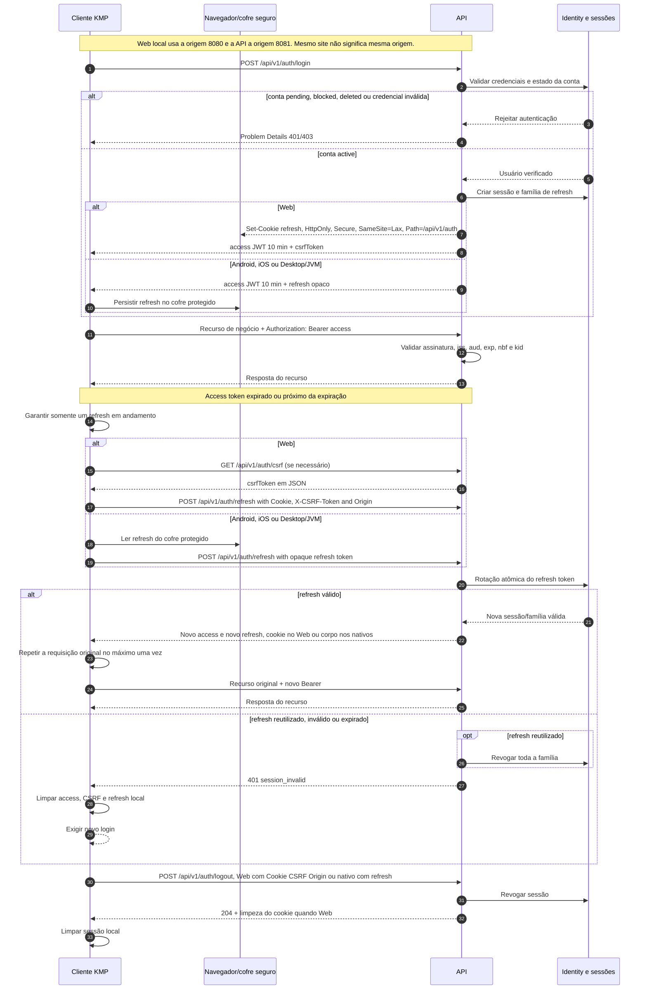

# ADR-011 — Sessão Web com refresh token em cookie protegido

> **Estado:** Aprovado
> **Data:** 2026-09-15
> **Responsáveis:** equipe MykytaDu API
> **Sprint/tarefas:** B0.1 / B0.1-T2
> **Decisões relacionadas:** D-005, P-007

## Contexto

O `mykytadu-app` atende Android, Desktop/JVM, iOS e Web, com WasmJS como target principal e JavaScript como fallback. A documentação do app proíbe tokens sensíveis em `localStorage`, mas exige restauração da sessão após reinício.

O baseline atual da API usa Bearer explícito, é stateless e desabilita CSRF por não depender de autenticação automática por cookie. Essa política não resolve a persistência segura da sessão Web sem perder a sessão no reload.

## Drivers da decisão

- não expor refresh tokens ao JavaScript do navegador;
- permitir restauração da sessão Web após reload;
- manter access tokens curtos e fora do banco;
- limitar a autenticação por cookie ao fluxo estritamente necessário;
- evitar `localStorage` e mecanismos equivalentes sem proteção adequada contra XSS.

## Opções consideradas

### Opção A — manter todos os tokens em memória

Preserva o baseline Bearer e evita persistência no navegador, mas encerra a sessão após reload ou reinício do contexto Web.

### Opção B — access token em memória e refresh token em cookie protegido

O access token continua sendo enviado como Bearer e vive somente em memória. O refresh token opaco é enviado automaticamente pelo navegador apenas ao endpoint de refresh, em cookie `HttpOnly`, `Secure` e com política `SameSite` definida para o ambiente.

### Opção C — persistir tokens em armazenamento Web acessível ao aplicativo

Permite restauração simples, mas aumenta a exposição de tokens a XSS e viola a restrição documentada pelo frontend para `localStorage`.

## Direção selecionada para avaliação

Foi selecionada a Opção B como direção da B0.1-T2, assumindo que Web e API serão publicados no mesmo site, usando o mesmo esquema (`https` fora do ambiente local):

- access token JWT permanece somente em memória no Web;
- refresh token permanece opaco e é armazenado no servidor somente como hash;
- o navegador recebe o refresh token em cookie `HttpOnly` e `Secure`;
- o cookie usará `SameSite=Lax` como padrão;
- o endpoint de refresh rotaciona o token e atualiza o cookie;
- logout revoga a sessão no servidor e limpa o cookie;
- endpoints de negócio continuam exigindo `Authorization: Bearer`;
- o cookie não deve ser usado para autenticar diretamente endpoints de negócio;
- refresh e logout serão operações `POST`;
- um synchronizer token associado à sessão será enviado pelo Web no header `X-CSRF-Token`;
- a API validará a `Origin` contra uma allowlist por ambiente;
- token CSRF ausente, inválido ou associado a outra sessão será rejeitado.

O endpoint Web para obter o synchronizer token será:

```http
GET /api/v1/auth/csrf
```

Ele usará o refresh cookie para identificar a sessão e retornará o token em JSON. O Web o manterá em memória; login e refresh também poderão devolvê-lo. O endpoint não expõe o refresh token e não executa uma alteração de negócio.

O CORS usará allowlist exata por ambiente, `Access-Control-Allow-Credentials: true`, métodos `GET` e `POST` e os headers `Content-Type`, `Authorization` e `X-CSRF-Token`. A origem local aprovada é `http://localhost:8080`; as origens remotas concretas dependem da decisão de hospedagem.

Também foram aprovados os seguintes parâmetros iniciais:

- access token com TTL de 10 minutos;
- refresh token com TTL de 30 dias;
- rotação do refresh token a cada uso;
- revogação de toda a família quando houver reutilização;
- cookie host-only, sem atributo `Domain`;
- cookie com `Path=/api/v1/auth`;
- allowlist CORS local contendo somente `http://localhost:8080`.

Para os access tokens, todos os clientes usarão a mesma audience `mykytadu-api`, com client IDs distintos:

- `mykytadu-web` para WasmJS e JavaScript;
- `mykytadu-android` para Android;
- `mykytadu-ios` para iOS;
- `mykytadu-desktop` para Desktop/JVM.

Nos clientes nativos, somente o refresh token será persistido: Android usará o
Keystore com armazenamento protegido, iOS usará o Keychain e Desktop/JVM usará
o cofre de credenciais do sistema. O access token permanecerá em memória. Se o
cofre nativo não estiver disponível, não haverá fallback em texto puro; o
cliente exigirá novo login ou manterá a sessão somente em memória.

A coordenação de refresh seguirá estas regras:

- o cliente permitirá somente um refresh em andamento por sessão;
- Web poderá usar Web Locks e BroadcastChannel apenas para coordenação, nunca
  para transmitir refresh tokens;
- o servidor fará a rotação de forma atômica;
- retries após resposta de rede desconhecida usarão `Idempotency-Key`;
- não haverá janela genérica de tolerância para refresh tokens antigos;
- a requisição original será repetida no máximo uma vez após refresh bem-sucedido;
- falha definitiva de refresh limpará a sessão local e exigirá novo login.

Esta política autoriza a implementação conforme o plano de adoção. As origens remotas concretas e os valores de configuração por ambiente permanecem vinculados à decisão de hospedagem.

## Fluxo aprovado de sessão

O diagrama abaixo representa o fluxo comum e as diferenças entre Web e clientes nativos. No Web, o navegador gerencia o cookie de refresh; nos clientes nativos, o refresh token é mantido no cofre protegido da plataforma. Endpoints de negócio recebem somente o access token como Bearer.



## Consequências

### Positivas

- refresh token não fica acessível ao JavaScript da aplicação;
- sessão Web pode ser restaurada sem `localStorage`;
- access token continua curto e não persistido;
- o modelo de cookie fica restrito ao refresh, reduzindo a superfície de CSRF.

### Negativas

- refresh por cookie introduz risco de CSRF no endpoint correspondente;
- CORS, credenciais, origem permitida e atributos do cookie precisam ser coordenados entre frontend e API;
- o fluxo Web diverge operacionalmente dos clientes nativos;
- logout e expiração precisam sincronizar estado local e estado do servidor.

## Itens em aberto para adoção

- origens remotas concretas e valores de configuração por ambiente;
- contrato formal do endpoint no OpenAPI da B0.2.

O compromisso de mesmo site não implica mesma origem: subdomínios ou portas diferentes continuam exigindo CORS e configuração explícita de origens.

## Plano de adoção

1. definir as origens remotas na decisão de hospedagem;
2. atualizar o baseline de segurança e o contrato HTTP;
3. validar o fluxo em navegador real, incluindo reload, logout, expiração e falha de CSRF;
4. somente depois implementar o adapter Web e os endpoints de sessão.

## Critérios de revisão

Reavaliar se o frontend abandonar a restauração de sessão Web, se houver restrição de hospedagem que impeça o cookie seguro ou se testes de segurança mostrarem que a combinação de origens e credenciais não pode ser controlada.
