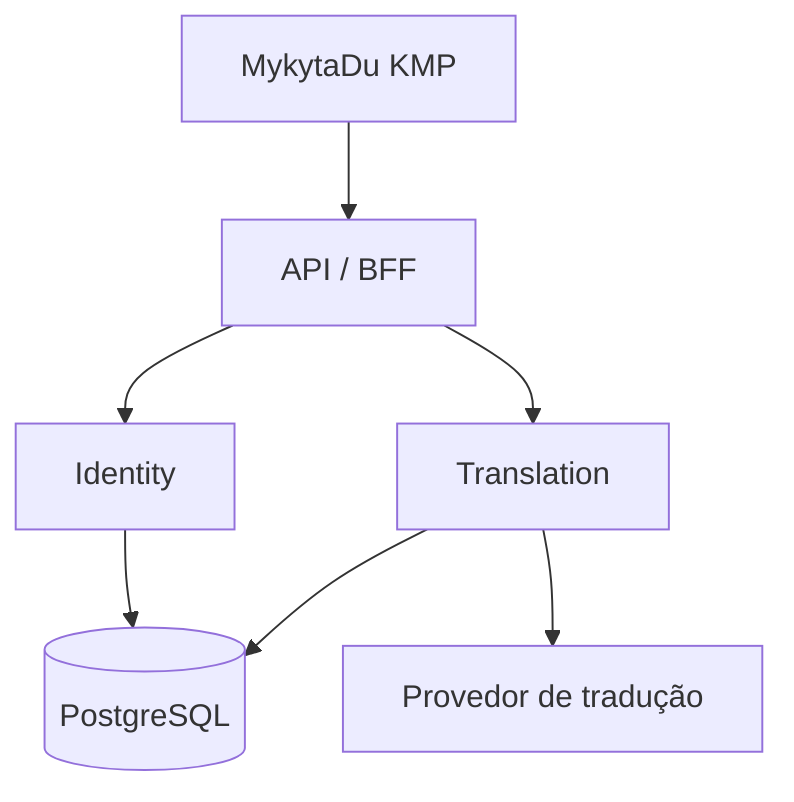

# MykytaDu API — Documento Mestre Backend

> **Status:** baseline arquitetural aprovado; especificação em evolução  
> **Versão:** 0.4
> **Data de referência:** 18 de setembro de 2026

## 1. Propósito

O backend do MykytaDu fornecerá capacidades que não devem residir no cliente multiplataforma:

1. **Identidade e autenticação:** cadastro, login, renovação e revogação de sessões, recuperação de acesso e evolução futura para provedores externos.
2. **Tradução:** tradução de conteúdos consumidos pelo aplicativo, inicialmente textos vindos de provedores de anime, com abstração do fornecedor de tradução, cache e controle de uso.
3. **BFF do MykytaDu:** uma API estável e orientada às necessidades do aplicativo, responsável por autenticação, autorização, validação, limites de uso e composição de respostas quando necessário.

O documento orienta arquitetura, ferramentas, dados e contratos. Ele é evolutivo: decisões ainda abertas aparecem explicitamente, em vez de serem escondidas em uma falsa sensação de acabamento.

## 2. Nome do projeto

### Decisão: `mykytadu-api`

O projeto e seu repositório devem usar o nome **`mykytadu-api`**. O nome é simples, direto e representa a interface estável oferecida ao aplicativo, sem impedir que a implementação reúna o BFF e os módulos de Identity e Translation.

Outras opções:

| Nome | Vantagem | Limitação |
| --- | --- | --- |
| `mykytadu-api` | Simples, direto e alinhado ao papel perante o cliente | **Selecionado** |
| `mykytadu-backend` | Claro, durável e não superespecifica | Mais amplo que o nome escolhido |
| `mykytadu-bff` | Preciso se servir exclusivamente ao app | Autenticação e tradução também são capacidades de domínio |
| `mykytadu-server` | Neutro | Pouco descritivo |

Neste documento, **MykytaDu API** identifica o produto e `mykytadu-api`, o projeto/repositório.

## 3. Direção arquitetural

### 3.1 Decisão principal: monólito modular

O sistema deve começar como um **monólito modular**, com módulos delimitados por capacidade de negócio. Identity e Translation são domínios distintos, porém não precisam começar como microserviços.

Essa escolha oferece:

- um único build e deploy;
- transações e operação simples;
- baixo custo de infraestrutura;
- fronteiras internas verificáveis;
- possibilidade de extrair um módulo quando volume, equipe ou disponibilidade realmente justificarem.



### 3.2 Módulos iniciais

| Módulo | Responsabilidade | Não deve conhecer |
| --- | --- | --- |
| `app` | bootstrap, configuração e composição dos módulos | regras de negócio específicas |
| `api` | endpoints, DTOs HTTP, validação de entrada, tratamento de erros | entidades JPA e detalhes de provedores |
| `identity` | usuário, credenciais, sessões, tokens e autorização | fornecedor de tradução |
| `translation` | solicitação, normalização, cache e seleção de provedor | credenciais do usuário além de sua identidade/autorização |
| `shared` | tipos técnicos mínimos, relógio, IDs e erros comuns | regras que pertençam a Identity ou Translation |

O módulo `shared` deve permanecer pequeno. “Compartilhado” não pode virar o armário onde a arquitetura esconde tudo o que não soube classificar.

### 3.3 Organização do código

Recomenda-se **package by feature**, com camadas internas por módulo:

```text
br.com.mykytadu
├── app
├── api
├── identity
│   ├── domain
│   ├── application
│   ├── infrastructure
│   └── web
├── translation
│   ├── domain
│   ├── application
│   ├── infrastructure
│   └── web
└── shared
```

Na primeira versão, os módulos podem ser pacotes dentro de um único módulo Gradle. Spring Modulith deve ser usado para documentar e testar as fronteiras. A divisão em subprojetos Gradle só será feita se o isolamento de compilação trouxer ganho concreto.

### 3.4 Comunicação interna

- Chamadas internas síncronas por interfaces de aplicação.
- Eventos de domínio apenas quando houver desacoplamento real, como `UserDisabled` causando revogação de sessões.
- Sem broker no MVP.
- Sem acesso direto às tabelas de outro módulo; integrações ocorrem por interfaces ou eventos.

### 3.5 Critérios futuros para extração

Um módulo só deve virar serviço independente diante de pelo menos um motivo verificável:

- escala muito diferente dos demais;
- requisito próprio de disponibilidade ou segurança;
- ciclo de deploy independente frequente;
- equipe proprietária independente;
- fornecedor ou processamento assíncrono que precise de isolamento.

A tradução é a candidata mais provável à futura extração, pois pode apresentar custo, latência e escala diferentes da autenticação.

## 4. Stack tecnológica proposta

### 4.1 Baseline

| Área | Escolha | Versão-base | Justificativa |
| --- | --- | --- | --- |
| Linguagem | Kotlin/JVM | 2.4.10 | Versão estável atual; linguagem alinhada ao cliente, sem tentar compartilhar código de domínio entre plataformas à força |
| JVM | Java | 25 LTS | Baseline LTS para projeto novo; toolchain fixa builds locais e CI |
| Framework | Spring Boot | 4.1.1 | Linha estável atual, adequada a projeto greenfield |
| Build | Gradle + Kotlin DSL | 9.5.0, wrapper versionado | Versão integralmente suportada pelo Kotlin 2.4.10, compatível com Java 25 e Spring Boot 4.1.1 |
| API | Spring MVC | gerenciado pelo Boot | Modelo simples e adequado ao acesso bloqueante via JPA; não adotar WebFlux sem carga que o justifique |
| Segurança | Spring Security + OAuth2 Resource Server/JOSE | gerenciado pelo Boot | Filtros, hash de senha, validação JWT e autorização |
| Modularidade | Spring Modulith | linha compatível com Boot 4.1 | Verificação das fronteiras e documentação dos módulos |
| Persistência | Spring Data JPA + Hibernate | gerenciado pelo Boot | Produtividade e familiaridade para o domínio inicial |
| Banco | PostgreSQL | 18.x | Banco relacional robusto; a versão 18 é a linha estável atual |
| Migrações | Flyway | gerenciado pelo Boot | Schema versionado e reproduzível |
| Contratos | OpenAPI 3.1 | especificação versionada no repositório | Contrato consumível pelo frontend e testável em CI |
| Observabilidade | Actuator + Micrometer | gerenciado pelo Boot | health, métricas e integração futura com OpenTelemetry |
| Contêineres | Docker + Compose | estável do ambiente | PostgreSQL local e execução reproduzível |

**Política de versões:** fixar Kotlin, Java, Spring Boot e plugins Gradle. Para bibliotecas pertencentes ao ecossistema Spring, preferir o BOM do Spring Boot e não declarar versões individuais sem necessidade. Atualizações devem passar por testes e registro em ADR/changelog.

As versões acima foram verificadas nas fontes oficiais em 04/09/2026. Kotlin 2.4.20 estava planejado, mas ainda não publicado como estável; portanto não entra no baseline.

### 4.2 Dependências iniciais

- Spring Boot Web MVC;
- Spring Security;
- OAuth2 Resource Server e JOSE;
- Spring Data JPA;
- Bean Validation;
- PostgreSQL Driver;
- Flyway;
- Spring Modulith;
- Actuator;
- Jackson Kotlin;
- Kotlin Reflection;
- cliente HTTP do Spring (`RestClient`) para o provedor de tradução;
- gerador/publicador OpenAPI compatível com a linha do Boot escolhida.

### 4.3 Testes e qualidade

- JUnit 5;
- AssertJ como estilo principal de assertions;
- MockK para doubles em Kotlin;
- Spring Boot Test;
- Testcontainers para PostgreSQL e testes de integração;
- WireMock ou MockWebServer para o provedor de tradução;
- ArchUnit e testes do Spring Modulith para fronteiras;
- Kover para cobertura;
- Detekt e ktlint para análise e formatação;
- testes de contrato OpenAPI no CI.

Não estabelecer uma meta cega de cobertura global. Serviços de domínio, segurança, rotação de tokens, adapters de tradução e regras de cache devem ter cobertura forte; configuração trivial não merece teatro estatístico.

## 5. Autenticação e segurança

### 5.1 Escopo recomendado do MVP

O MVP terá autenticação própria de primeira parte:

- cadastro por e-mail e senha;
- verificação de e-mail;
- login;
- access token JWT de curta duração;
- refresh token opaco, rotativo e armazenado somente como hash;
- logout da sessão atual e de todas as sessões;
- recuperação e redefinição de senha;
- consulta e atualização do perfil mínimo;
- papéis `USER` e `ADMIN`, sem sistema genérico de permissões inicialmente.

O fluxo deve ser descrito como **API de autenticação própria**, não como servidor OAuth/OIDC completo. Se futuramente houver login social, terceiros ou múltiplos clientes públicos, será avaliada a adoção completa de OAuth 2.1/OIDC com Authorization Code + PKCE.

### 5.2 Regras mínimas

- Senhas com Argon2id; parâmetros versionados para permitir rehash.
- Access token entre 5 e 15 minutos.
- Refresh token rotativo, com detecção de reutilização e revogação da família comprometida.
- JWT assinado por chave assimétrica; `kid` no header para rotação.
- Chaves e segredos fora do repositório.
- Rate limit em cadastro, login, recuperação e tradução.
- Respostas de recuperação que não revelem se o e-mail existe.
- Auditoria de eventos sensíveis sem registrar senha, tokens ou conteúdo pessoal desnecessário.
- CORS restrito quando aplicável; clientes nativos não dependem de CORS como mecanismo de segurança.
- TLS obrigatório em qualquer ambiente remoto.

## 6. Domínio de tradução

### 6.1 Responsabilidade

O backend receberá texto e contexto controlados, aplicará normalização, verificará cache, chamará o provedor configurado quando necessário e devolverá a tradução juntamente com metadados úteis.

O cliente nunca receberá a chave do fornecedor. A integração será definida por uma porta `TranslationProvider`, permitindo trocar de fornecedor ou utilizar uma implementação local no futuro.

### 6.2 Escopo inicial

- idioma de origem explícito ou `auto`;
- idioma-alvo inicialmente `pt-BR`;
- tradução de descrição e outros pequenos campos textuais;
- conteúdo limitado por tamanho e finalidade;
- preservação segura de quebras de linha e tratamento definido para HTML vindo da fonte;
- cache por hash do conteúdo normalizado e parâmetros relevantes;
- timeout, retry curto apenas para falhas transitórias e circuit breaker somente se a operação real demonstrar necessidade.

### 6.3 Chave de cache conceitual

```text
sha256(normalizedText + sourceLanguage + targetLanguage + contentType + provider + modelVersion)
```

O nome ou ID do anime não basta como chave: descrições podem mudar no provedor externo. O hash evita entregar uma tradução antiga para um texto novo.

## 7. Persistência minimalista

### 7.1 Estratégia

Usar uma única instância PostgreSQL e separar ownership por schemas lógicos:

- `identity`: contas, credenciais, sessões e tokens de ação;
- `translation`: cache e registro técnico de consumo;
- `public` deve permanecer vazio ou conter apenas extensões controladas.

Migrations Flyway versionadas seguem `VyyyyMMddHHmmss-descricao.sql`, com `localDateTime` de `America/Sao_Paulo`, precisão de segundos e `-` configurado como separador. A descrição usa `snake_case`. Antes de criar uma migration, deve-se conferir a maior versão existente; scripts já aplicados não são editados e correções avançam o schema por uma nova migration.

### 7.2 Tabelas iniciais

| Schema/tabela | Campos essenciais | Observação |
| --- | --- | --- |
| `identity.users` | `id UUIDv7`, `email`, `normalized_email`, `display_name`, `status`, `email_verified_at`, timestamps | e-mail normalizado e único; status: pending/active/blocked/deleted |
| `identity.password_credentials` | `user_id`, `password_hash`, `algorithm`, `updated_at` | separa credencial do perfil |
| `identity.roles` | `user_id`, `role` | chave composta; somente USER/ADMIN inicialmente |
| `identity.sessions` | `id`, `user_id`, `refresh_token_hash`, `token_family_id`, `client_id`, `csrf_token_hash`, `expires_at`, `revoked_at`, metadados mínimos | suporta login Web/nativo, rotação, logout e detecção de reuse; hashes sensíveis não são recuperáveis |
| `identity.action_tokens` | `id`, `user_id`, `type`, `token_hash`, `expires_at`, `consumed_at` | verificação de e-mail e reset de senha |
| `translation.translations` | `id`, `content_hash`, idiomas, tipo, texto traduzido, provider/model, `created_at`, `expires_at` | unique sobre chave lógica; texto original não é persistido; cache expira em 30 dias |
| `translation.usage_daily` | `day`, `principal_id`, contadores de caracteres e requisições | opcional no primeiro deploy; útil para quota e custo |

### 7.3 O que não armazenar agora

- cópia completa do catálogo AniList;
- listas e progresso do usuário, até que o domínio correspondente seja planejado;
- tokens JWT de acesso;
- refresh tokens, tokens de reset ou verificação em texto puro;
- logs contendo credenciais ou textos traduzidos integralmente;
- configurações genéricas em tabela “key/value”.

### 7.4 IDs, datas e exclusão

- UUIDv7 para entidades persistidas, aproveitando ordenação temporal sem IDs enumeráveis.
- `Instant`/UTC no backend e `timestamptz` no PostgreSQL.
- usuário excluído é marcado como `deleted`, perde acesso imediatamente e tem credenciais, tokens e atributos pessoais removidos ou anonimizados conforme a política aprovada no [ADR-014](adr/ADR-014-politica-de-retencao-e-exclusao.md); um booleano isolado não resolve privacidade.
- índices devem nascer das consultas previstas, não de decoração arquitetural.

## 8. Contrato HTTP inicial

Base path: `/api/v1`. JSON em `camelCase`. Datas em ISO-8601 UTC. IDs como strings UUID. A especificação OpenAPI será fonte da verdade do contrato HTTP.

### 8.1 Identity

| Método | Endpoint | Objetivo | Autorização |
| --- | --- | --- | --- |
| `POST` | `/auth/register` | criar conta | pública + rate limit |
| `POST` | `/auth/verify-email` | confirmar e-mail | token de ação |
| `POST` | `/auth/verify-email/resend` | reenviar verificação sem revelar a conta | pública + rate limit |
| `POST` | `/auth/login` | autenticar | pública + rate limit |
| `POST` | `/auth/refresh` | rotacionar sessão | refresh token |
| `POST` | `/auth/logout` | revogar sessão atual | autenticada |
| `POST` | `/auth/logout-all` | revogar todas as sessões | autenticada |
| `POST` | `/auth/password/forgot` | iniciar recuperação | pública + rate limit |
| `POST` | `/auth/password/reset` | definir nova senha | token de ação |
| `GET` | `/me` | obter perfil atual | autenticada |
| `PATCH` | `/me` | atualizar perfil permitido | autenticada |

### 8.2 Translation

| Método | Endpoint | Objetivo | Autorização |
| --- | --- | --- | --- |
| `POST` | `/translations` | traduzir um conteúdo | autenticada |
| `POST` | `/translations/batch` | traduzir lote limitado | autenticada; avaliar após endpoint simples |

Exemplo conceitual:

```json
{
  "text": "Original description",
  "sourceLanguage": "en",
  "targetLanguage": "pt-BR",
  "contentType": "ANIME_DESCRIPTION"
}
```

```json
{
  "translation": "Descrição traduzida",
  "sourceLanguage": "en",
  "targetLanguage": "pt-BR",
  "cached": true
}
```

### 8.3 Erros

Adotar `application/problem+json` baseado em RFC 9457, com:

- `type`, `title`, `status`, `detail`, `instance`;
- `code` estável e legível por máquina;
- `traceId` para suporte;
- `errors[]` para violações de campos.

O cliente deve tomar decisões por `status` e `code`, nunca por comparação do texto de `detail`.

## 9. Contrato com o frontend

Para desbloquear a Sprint 12 do frontend, o backend não precisa estar totalmente pronto, mas estes artefatos precisam estar congelados em uma primeira versão:

1. OpenAPI 3.1 versionado com schemas, exemplos e erros.
2. Fluxos de registro, login, refresh, logout e recuperação.
3. Política de armazenamento de tokens para Android, Desktop/JVM, iOS e Web (WasmJS principal e JavaScript fallback), respeitando a proibição de tokens sensíveis em `localStorage`.
4. Endpoint e limites de tradução.
5. códigos de erro estáveis.
6. ambientes e URLs base.
7. mecanismo de compatibilidade e depreciação de `/api/v1`.
8. mock server ou fixtures gerados a partir do OpenAPI.

Não é recomendado compartilhar classes Kotlin/JVM diretamente com o KMP. O contrato deve ser independente de linguagem; clientes podem ser gerados ou implementados no frontend a partir do OpenAPI.

## 10. Operação e ambientes

### 10.1 Ambientes

- `local`: aplicação + PostgreSQL via Compose e provedor de tradução fake/sandbox;
- `test`: Testcontainers e adapters controlados;
- `staging`: alvo no Render, com dados não produtivos, limites baixos e ambiente isolado;
- `production`: alvo no Render, com segredos gerenciados, TLS, backups e observabilidade; ativação depende de orçamento.

### 10.2 Configuração

- variáveis de ambiente, grupos de ambiente ou secret manager; no Render, secrets não ficam no repositório nem na imagem;
- profiles apenas para composição técnica, nunca para alterar regras de negócio;
- Flyway executado de forma controlada no deploy;
- endpoint de liveness separado de readiness;
- logs estruturados em JSON; a coleta e retenção remotas seguem a configuração
  do ambiente;
- correlação via `traceId`.

### 10.3 CI mínimo

1. compilação e análise estática;
2. testes unitários;
3. testes de módulos;
4. integração com PostgreSQL via Testcontainers;
5. validação do OpenAPI e compatibilidade retroativa;
6. construção da imagem OCI;
7. varredura de dependências e imagem;
8. deploy de staging somente após todos os gates.

## 11. Fora do escopo inicial

- microserviços e service discovery;
- Kubernetes;
- Kafka/RabbitMQ;
- API Gateway separado;
- Redis antes de métricas justificarem cache distribuído;
- autenticação social;
- servidor OIDC completo;
- catálogo próprio de animes;
- biblioteca/progresso do usuário;
- painel administrativo completo;
- tradução assíncrona de grandes documentos.

## 12. Roadmap proposto do backend

### Fase B0 — Decisões e contrato

- validar este documento;
- validar o provedor inicial e seu benchmark;
- fechar fluxos de autenticação;
- criar ADRs das decisões centrais;
- produzir OpenAPI inicial e mocks para o frontend.

### Fase B1 — Fundação

- criar repositório/projeto;
- configurar stack, módulos, qualidade e CI;
- PostgreSQL, Flyway e observabilidade básica;
- convenção de erros e testes de arquitetura.

### Fase B2 — Identity

- cadastro, verificação, login e tokens;
- refresh rotativo e revogação;
- recuperação de senha;
- testes de segurança e integração.

### Fase B3 — Translation

- porta de fornecedor e adapter inicial;
- endpoint, normalização e cache;
- limites de uso, métricas e falhas tipadas;
- testes com fornecedor simulado e smoke test controlado.

### Fase B4 — Integração com o KMP

- validar OpenAPI contra os contratos do frontend;
- disponibilizar staging;
- executar fluxos ponta a ponta;
- congelar o contrato mínimo necessário à Sprint 12.

## 13. Decisões pendentes

Estas respostas alteram o contrato ou os dados e devem ser resolvidas antes da implementação correspondente. As decisões sobre cadastro, verificação, entrega e reemissão de e-mail, audiences/client IDs, fronteira da sessão inicial e retenção/exclusão foram resolvidas em [ADR-010](adr/ADR-010-cadastro-com-verificacao-de-email.md), [ADR-011](adr/ADR-011-sessao-web-com-refresh-token-em-cookie.md), [ADR-014](adr/ADR-014-politica-de-retencao-e-exclusao.md), [ADR-017](adr/ADR-017-enviar-email-apos-commit-com-reemissao-segura.md) e [ADR-018](adr/ADR-018-criar-sessao-inicial-no-login-da-b21.md).

1. **Tradução:** o provedor inicial foi definido como LibreTranslate self-hosted com Argos, com adapter substituível em [ADR-012](adr/ADR-012-libretranslate-com-adapter-substituivel.md); orçamento operacional e validação antes da produção permanecem pendentes.
2. **Operação:** Render foi definido como hospedagem-alvo da API no [ADR-015](adr/ADR-015-render-como-hospedagem-alvo-da-api.md); ativação, domínio, região e orçamento permanecem pendentes.

## 14. Critérios de aceite desta especificação inicial

- arquitetura inicial escolhida e razões registradas;
- responsabilidades de Identity e Translation separadas;
- stack e política de versões definidas;
- modelo mínimo de persistência revisado;
- superfície preliminar da API compreensível pelo frontend;
- riscos de segurança e privacidade explicitados;
- decisões pendentes priorizadas;
- roadmap do backend alinhado ao marco da Sprint 12 do KMP.

## 15. Referências técnicas

- [Spring Boot — versão e visão geral](https://spring.io/projects/spring-boot/)
- [Kotlin — releases e política de suporte](https://kotlinlang.org/docs/releases.html)
- [Spring Security — OAuth 2.1 Authorization Server](https://docs.spring.io/spring-security/reference/servlet/oauth2/authorization-server/index.html)
- [PostgreSQL 18 — documentação](https://www.postgresql.org/docs/current/index.html)
- [RFC 9457 — Problem Details for HTTP APIs](https://www.rfc-editor.org/rfc/rfc9457.html)
- [OpenAPI Specification 3.1](https://spec.openapis.org/oas/v3.1.0.html)

## 16. Registro de decisões arquiteturais

| ID | Decisão | Estado |
| --- | --- | --- |
| D-001 | [Adotar monólito modular](adr/ADR-001-adotar-monolito-modular.md) | **aprovada** |
| D-002 | [Separar Identity e Translation por módulos e schemas](adr/ADR-002-separar-identity-e-translation.md) | **aprovada** |
| D-003 | [Usar Kotlin/JVM + Spring Boot](adr/ADR-003-usar-kotlin-jvm-e-spring-boot.md); matriz detalhada em [ADR-009](adr/ADR-009-fixar-matriz-tecnologica-inicial.md) | **aprovada** |
| D-004 | [Usar PostgreSQL como única persistência inicial](adr/ADR-004-usar-postgresql-como-persistencia-inicial.md) | **aprovada** |
| D-005 | [Usar JWT curto + refresh opaco rotativo](adr/ADR-005-usar-jwt-curto-e-refresh-rotativo.md); Web detalhado em [ADR-011](adr/ADR-011-sessao-web-com-refresh-token-em-cookie.md) | **aprovada** |
| D-006 | [Usar OpenAPI como fonte da verdade dos contratos](adr/ADR-006-usar-openapi-como-fonte-da-verdade.md) | **aprovada** |
| D-007 | [Não compartilhar modelos compilados entre backend JVM e cliente KMP](adr/ADR-007-nao-compartilhar-modelos-compilados-com-kmp.md) | **aprovada** |
| D-008 | [Nomear o projeto e repositório como `mykytadu-api`](adr/ADR-008-nomear-projeto-e-repositorio-mykytadu-api.md) | **aprovada** |
