# MykytaDu API — Modelagem evolutiva e arquitetura

> **Status:** modelo conceitual inicial; evolui com ADRs e implementação
> **Versão:** 0.1
> **Data de referência:** 4 de setembro de 2026
> **Documento de origem:** [Documento Mestre Backend](documento-mestre-backend.md)

## 1. Finalidade e regras de evolução

Este documento descreve as visões arquiteturais e o modelo de dados pretendido para o MykytaDu API. Ele é prescritivo nas decisões já aprovadas e indicativo nos detalhes ainda dependentes de produto ou fornecedor.

Convenções:

- **Aprovado:** decisão registrada no documento mestre.
- **Proposto:** detalhamento recomendado, sujeito à validação durante a sprint correspondente.
- **Pendente:** escolha que não deve ser cristalizada na implementação antes de decisão.
- diagramas mostram relações e responsabilidades, não necessariamente classes ou tabelas finais;
- toda divergência relevante entre este documento, OpenAPI, migrações e código deve ser resolvida e documentada.

## 2. Contexto do sistema

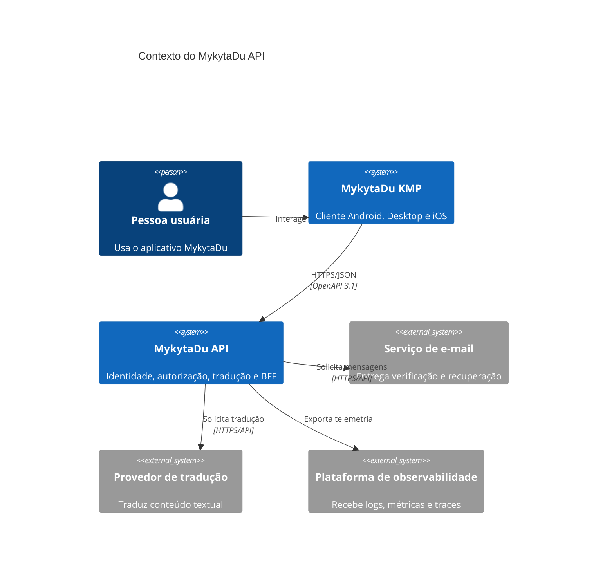

O cliente conversa apenas com uma API estável. Chaves de fornecedor, regras de sessão, cache e persistência permanecem no backend.

## 3. Visão de contêineres

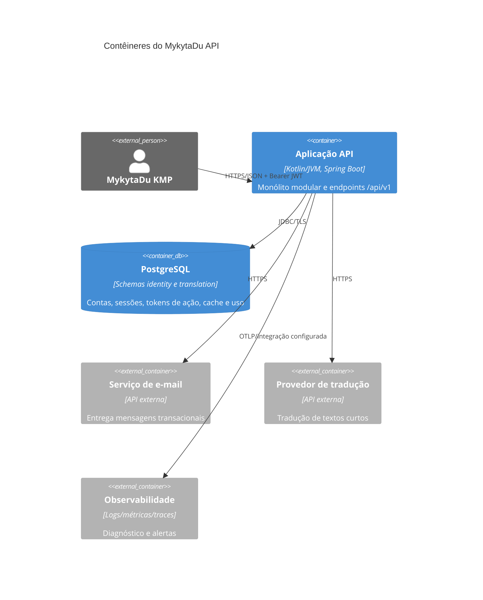

**Decisão aprovada:** um único deploy e uma única instância PostgreSQL no início. Serviços externos são acessados por adapters substituíveis.

## 4. Visão modular interna

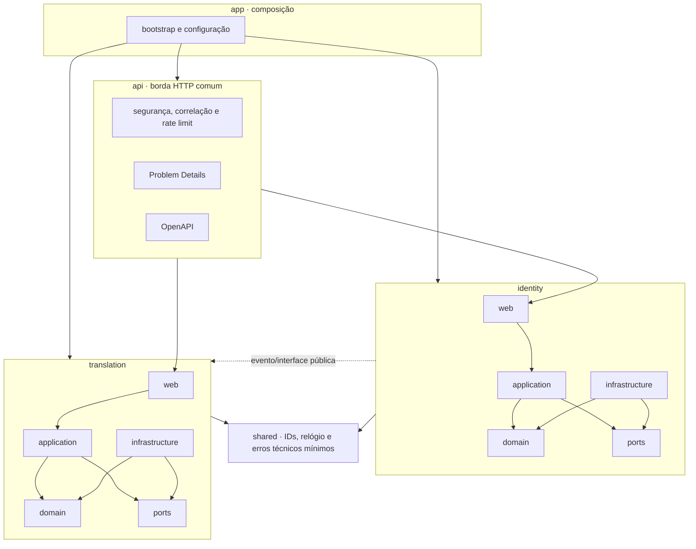

### 4.1 Responsabilidades e dependências permitidas

| Módulo | Responsabilidade | Dependências permitidas | Dependências proibidas |
| --- | --- | --- | --- |
| `app` | bootstrap, wiring e configuração técnica | interfaces públicas de todos os módulos | regras de negócio próprias |
| `api` | preocupações HTTP compartilhadas, contrato e erros | APIs públicas de aplicação e `shared` | entidades JPA, SDK de fornecedor |
| `identity` | conta, credencial, papel, sessão e tokens de ação | `shared` e portas próprias | tabelas/adapters de Translation |
| `translation` | normalização, tradução, cache, quota e consumo | identidade pública mínima, `shared` e portas próprias | credenciais e tabelas de Identity |
| `shared` | tipos técnicos estáveis e mínimos | biblioteca padrão/framework estritamente necessário | regras de Identity ou Translation |

Chamadas síncronas usam interfaces de aplicação. Eventos internos só são usados quando existe desacoplamento real; por exemplo, desativar usuário pode publicar `UserDisabled`, consumido para revogar sessões. Não há broker no MVP.

## 5. Camadas por módulo

```text
feature
├── domain          # entidades, value objects, políticas e eventos
├── application     # casos de uso, portas de entrada/saída e transações
├── infrastructure  # JPA, clientes externos e configuração do adapter
└── web             # controllers, DTOs e mapeamento HTTP
```

Regras:

- `domain` não depende de Spring, HTTP, JPA ou SDK externo;
- `application` coordena casos de uso e define limites transacionais;
- `infrastructure` implementa portas e converte modelos externos;
- `web` valida formato de entrada, autenticação e representação, mas não concentra regra de negócio;
- DTO HTTP, modelo de domínio, entidade de persistência e DTO externo são modelos distintos quando suas responsabilidades divergirem.

## 6. Modelo de domínio — Identity

### 6.1 Agregados e conceitos

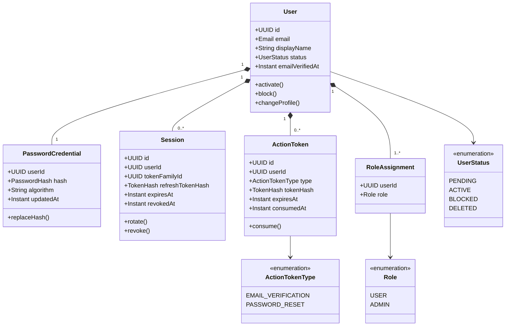

### 6.2 Invariantes propostas

- e-mail é normalizado antes da comparação e é único entre contas conforme política de exclusão ainda pendente;
- toda conta nasce com papel `USER` e nunca sem ao menos um papel válido;
- apenas credenciais com algoritmo/parâmetros reconhecidos podem autenticar; parâmetros antigos provocam rehash após login válido;
- token de ação é de uso único, tem finalidade específica e expira;
- refresh token só existe em texto puro no instante de emissão/recepção; persiste-se seu hash;
- uma rotação consome o token anterior atomicamente;
- reutilização de token consumido revoga toda a família;
- usuário bloqueado ou excluído não renova sessão;
- access token não é persistido.

## 7. Modelo de domínio — Translation

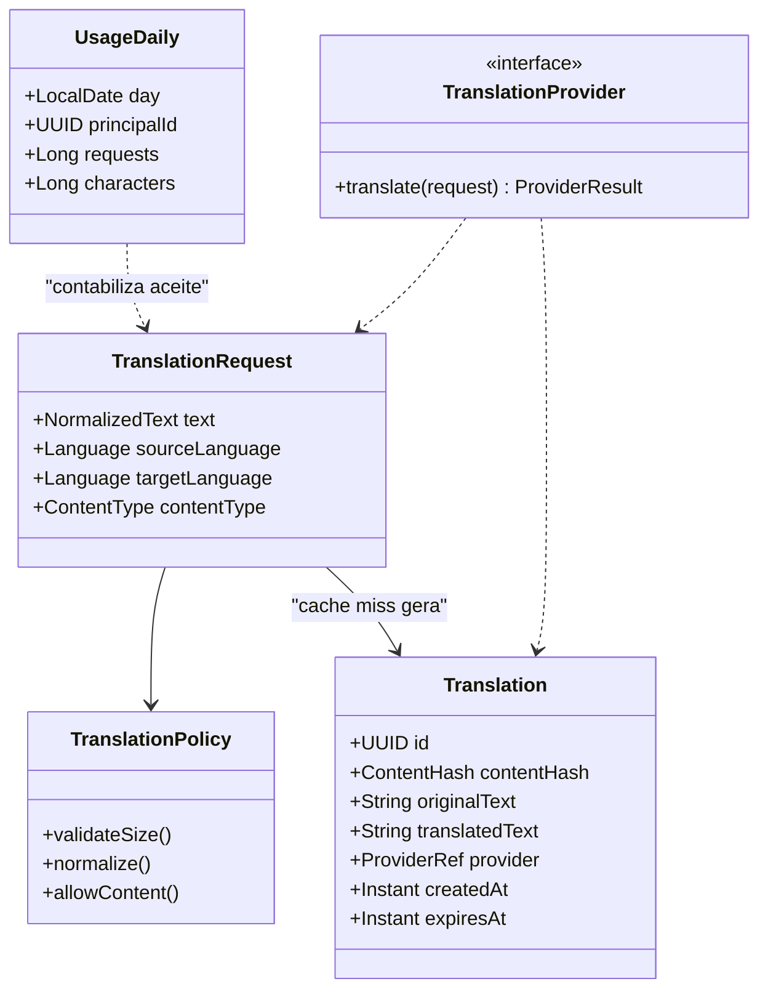

### 7.1 Chave lógica de cache

```text
sha256(normalizedText + sourceLanguage + targetLanguage + contentType + provider + modelVersion)
```

O formato serializado usado antes do hash deve ser canônico e versionado para evitar colisões por concatenação ambígua. Exemplo proposto: campos com tamanho prefixado ou JSON canônico contendo `cacheKeyVersion`.

### 7.2 Invariantes propostas

- texto vazio ou acima do limite não chega ao fornecedor;
- apenas combinações de idioma e tipo de conteúdo permitidas são aceitas;
- normalização é determinística e não remove conteúdo semanticamente relevante;
- um mesmo hash lógico identifica no máximo uma tradução válida por política de retenção;
- hit de cache não consome quota externa, mas pode contar como uso da API separadamente;
- falha do fornecedor não cria entrada de tradução válida;
- métricas e logs nunca usam o texto como label ou mensagem integral;
- a retenção de original e tradução segue política ainda pendente.

## 8. Modelo relacional inicial

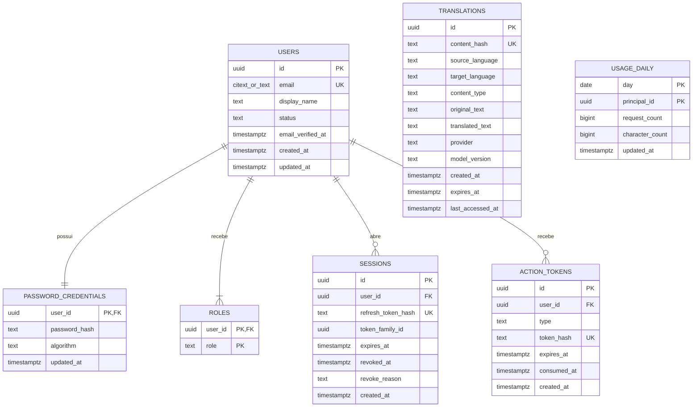

`USAGE_DAILY.principal_id` referencia conceitualmente o usuário, mas o módulo Translation não deve criar foreign key nem consultar diretamente `identity.users`; integridade entre módulos ocorre pela API/eventos e por processos de reconciliação. `TRANSLATIONS` não referencia anime ou usuário no modelo inicial.

### 8.1 Ownership e constraints

| Schema | Tabelas | Owner lógico | Regras centrais |
| --- | --- | --- | --- |
| `identity` | `users`, `password_credentials`, `roles`, `sessions`, `action_tokens` | módulo Identity | unicidade de e-mail normalizado; FKs internas; tokens em hash |
| `translation` | `translations`, `usage_daily` | módulo Translation | unicidade da chave lógica; contadores não negativos; nenhuma FK para Identity |
| `public` | nenhuma tabela de negócio | plataforma | apenas extensões explicitamente controladas |

### 8.2 Índices orientados a consultas

Índices iniciais candidatos, a confirmar com consultas reais:

- `identity.users(normalized_email)` unique;
- `identity.sessions(refresh_token_hash)` unique;
- `identity.sessions(user_id)` filtrado ou composto para sessões não revogadas;
- `identity.sessions(token_family_id)` para revogação de família;
- `identity.action_tokens(token_hash)` unique e índice para limpeza por expiração;
- `translation.translations(content_hash)` unique;
- `translation.translations(expires_at)` se houver limpeza por TTL;
- chave primária composta de `translation.usage_daily(day, principal_id)`.

Não adicionar índices sem consulta-alvo e evidência por plano/medição.

## 9. Fluxos principais

### 9.1 Cadastro e verificação

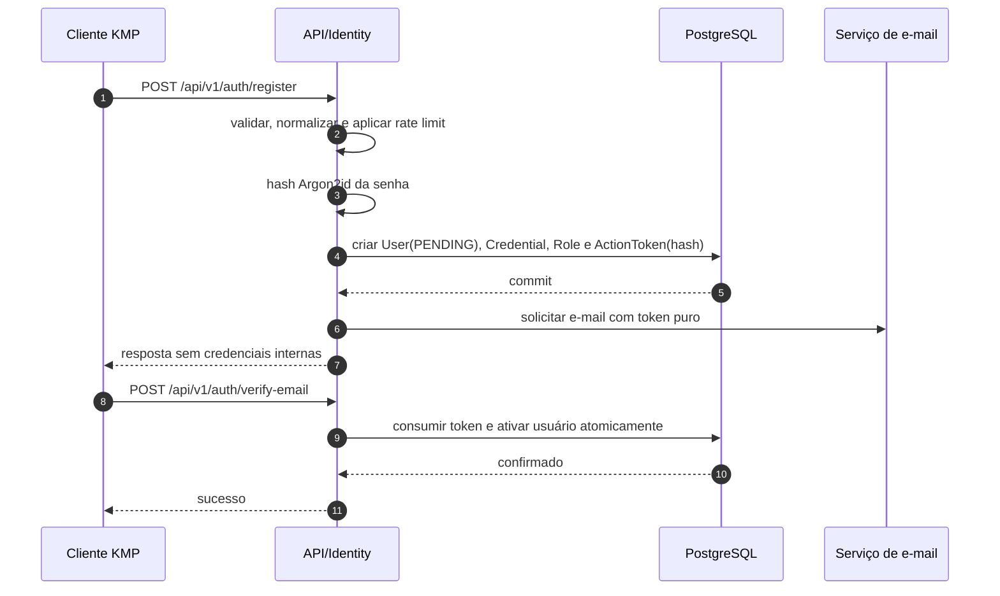

**Pendente:** estratégia para falha do serviço de e-mail após commit. Sem broker no MVP, opções incluem envio síncrono com reemissão idempotente ou outbox processada localmente; a escolha exige ADR.

### 9.2 Login e refresh rotativo

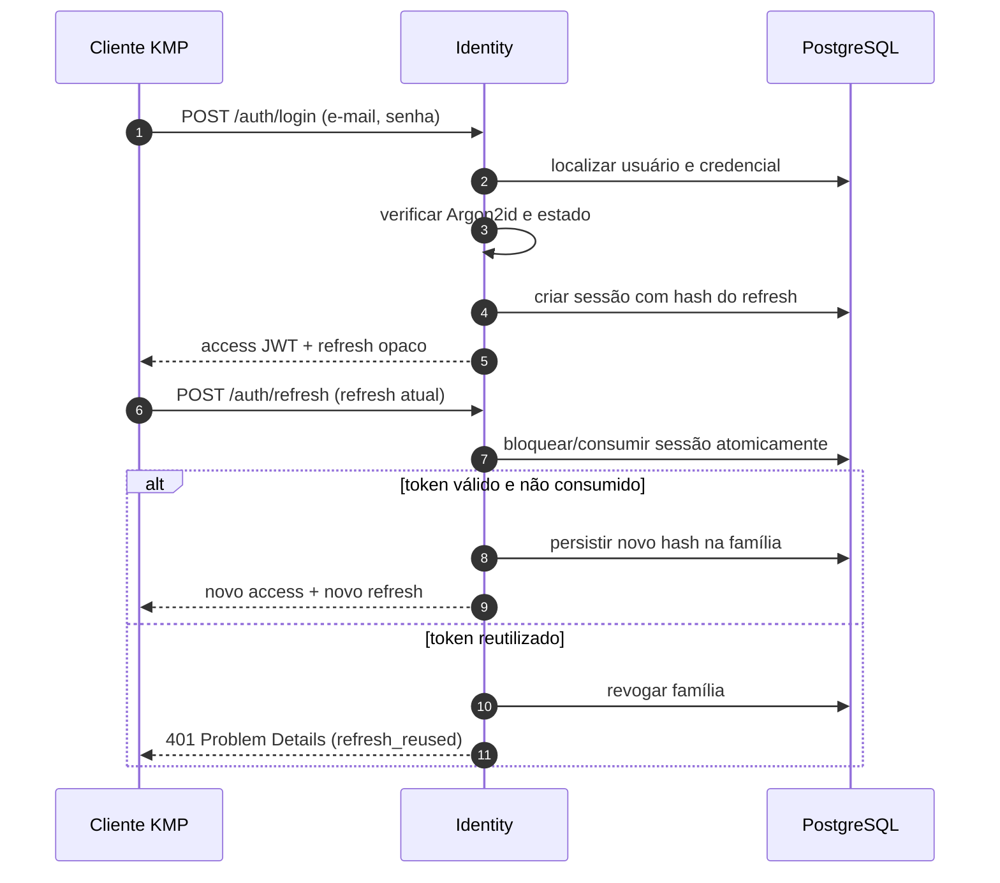

JWT proposto: `sub`, `iss`, `aud`, `iat`, `exp`, `jti` e papéis mínimos. Dados mutáveis ou pessoais desnecessários não devem virar claims.

### 9.3 Tradução com cache

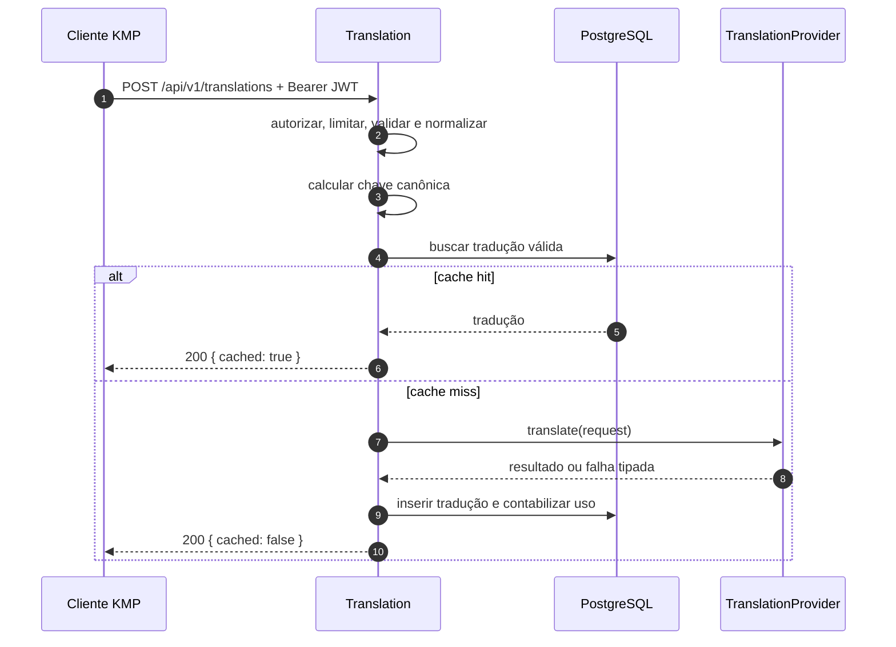

Em concorrência, a constraint única é a última linha de defesa. A estratégia de espera, upsert ou releitura após conflito deve ser medida, mantendo resultado correto e sem duplicação observável.

## 10. Estados e ciclos de vida

### 10.1 Usuário

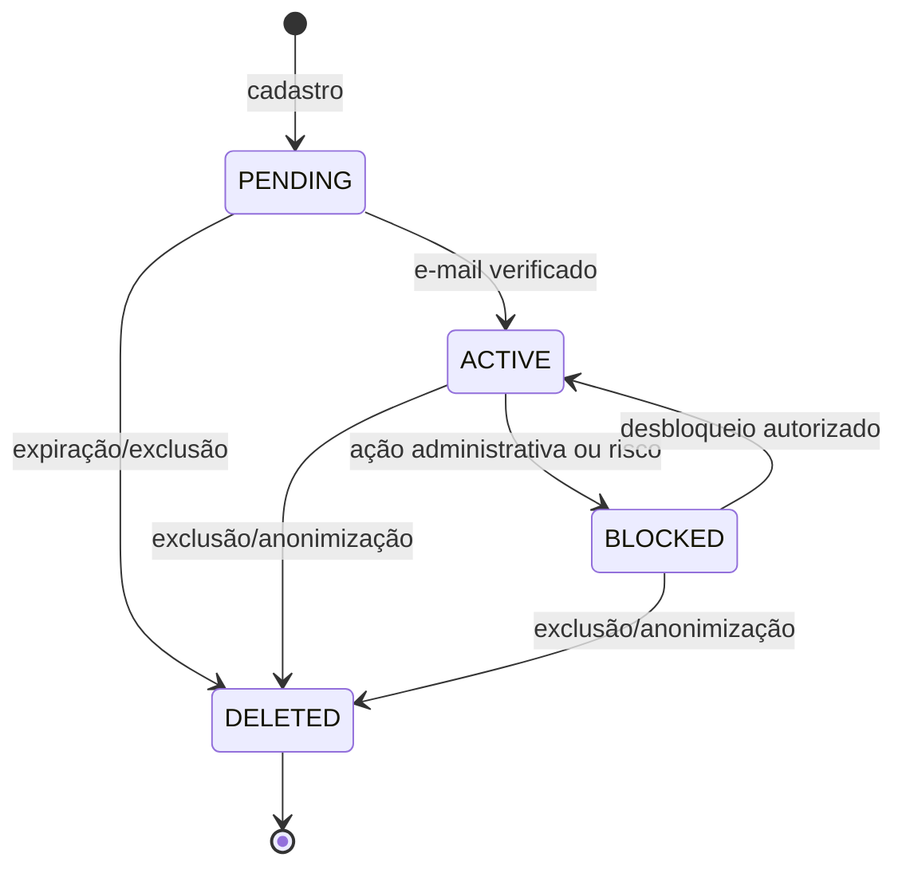

**Pendente:** exclusão imediata, janela de recuperação ou anonimização. O estado `DELETED` representa intenção de domínio, não substitui o processo de privacidade.

### 10.2 Sessão

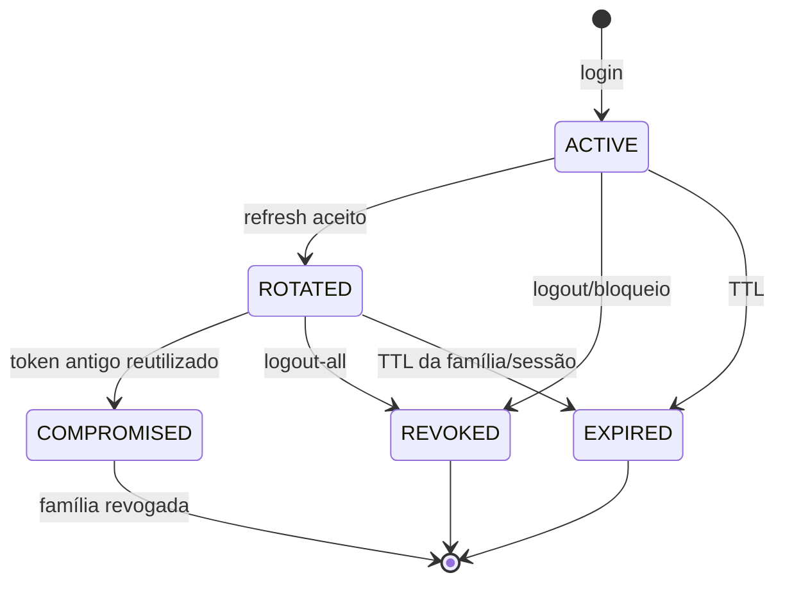

Os estados podem ser derivados de timestamps e motivo de revogação em vez de coluna enum; a persistência final deve preservar as invariantes, não necessariamente reproduzir este diagrama literalmente.

## 11. Contrato HTTP e limites de arquitetura

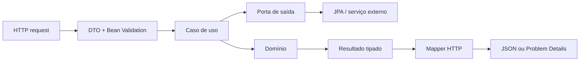

- Base path `/api/v1` e JSON `camelCase`.
- OpenAPI 3.1 é fonte da verdade; este documento explica arquitetura, não duplica schemas completos.
- validação sintática ocorre na borda; regras de negócio permanecem no domínio/aplicação;
- `status` e `code` orientam o cliente; `detail` é humano e pode variar;
- `traceId` correlaciona suporte sem expor detalhes internos;
- autenticação é própria de primeira parte, não um servidor OAuth/OIDC completo.

## 12. Segurança e fronteiras de confiança

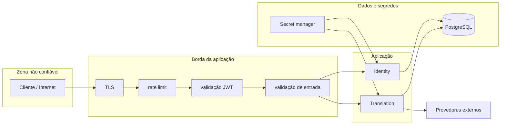

Controles mínimos:

- Argon2id com parâmetros versionados e rehash planejado;
- JWT assimétrico com `kid`, issuer, audience, expiração curta e rotação de chaves;
- refresh/action tokens aleatórios, opacos e persistidos apenas como hash;
- autorização deny-by-default nos endpoints protegidos;
- rate limit em cadastro, login, recuperação e tradução;
- respostas de recuperação resistentes à enumeração;
- auditoria de eventos sensíveis com minimização e sem segredos;
- timeouts em toda chamada externa e TLS em ambientes remotos;
- secrets fora de imagens, arquivos versionados e logs.

## 13. Observabilidade

### 13.1 Sinais

| Sinal | Conteúdo recomendado | Evitar |
| --- | --- | --- |
| Logs | `timestamp`, nível, serviço, ambiente, `traceId`, evento, resultado e código seguro | senha, tokens, hash de token, texto traduzido integral, e-mail cru desnecessário |
| Métricas HTTP | volume, latência e status por rota normalizada | path com UUID/e-mail, labels de alta cardinalidade |
| Identity | login aceito/negado por categoria, refresh reuse, revogações | identificar pessoa em label |
| Translation | hit/miss, caracteres, latência/erro por provedor e quota | conteúdo como label |
| Traces | spans de banco e provedor, correlação de request | headers de autorização e payload sensível |

### 13.2 Health

- **Liveness:** confirma que o processo está responsivo; não depende de banco ou fornecedor.
- **Readiness:** confirma capacidade de atender, incluindo dependências essenciais como banco.
- fornecedor de tradução degradado não deve necessariamente derrubar toda a API; deve refletir na capacidade específica e em alertas.

## 14. Implantação inicial

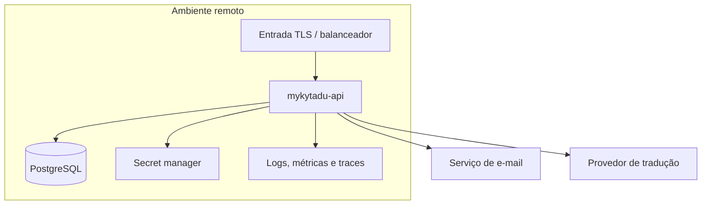

A aplicação deve ser stateless quanto a processo; sessão durável fica no PostgreSQL. Escalar réplicas é possível sem alterar o domínio, desde que rotação, rate limit e concorrência preservem consistência. A tecnologia concreta de rate limit distribuído permanece decisão operacional; Redis não é pressuposto.

## 15. Evolução arquitetural esperada

| Estágio | Forma | Condição de entrada | Evidência para evoluir |
| --- | --- | --- | --- |
| E0 | um módulo Gradle, pacotes por feature | início do projeto | baseline aprovado |
| E1 | monólito modular verificado por Modulith | fundação | dependências e ownership testados |
| E2 | possível separação em subprojetos Gradle | compilação/acoplamento causam dor concreta | ganho mensurável de isolamento ou build |
| E3 | possível extração de Translation | escala, disponibilidade, custo ou equipe independentes | ao menos um critério verificável do documento mestre e análise de custo |

Uma extração futura deve preservar a API pública e introduzir contrato interno, observabilidade, tolerância a falhas e consistência deliberada. Ela não é uma consequência automática do crescimento do código.

## 16. Decisões pendentes e impacto arquitetural

| ID | Decisão | Impacta | Deve ser resolvida até |
| --- | --- | --- | --- |
| P-001 | login somente e-mail/senha ou social | contrato, Identity, possíveis client IDs/OIDC | B0.1 |
| P-002 | login antes da verificação | estados, autorização e UX | B0.1 |
| P-003 | provedor de tradução e orçamento | adapter, limites, retenção, observabilidade | B0.1 |
| P-004 | texto enviado ou consulta AniList pelo backend | contexto, contrato, cache e termos de uso | B0.1 |
| P-005 | TTL/retenção das traduções | schema, jobs e privacidade | antes de B3.2 |
| P-006 | exclusão/anonimização de conta | modelo, constraints e operação | antes de B2.3 |
| P-007 | audiences/client IDs por plataforma | claims e validação JWT | antes de B2.1 |
| P-008 | hospedagem | deploy, secrets, backup e observabilidade | antes de B4.1 |
| P-009 | entrega confiável de e-mail sem broker | transação, reenvio e possível outbox local | antes de B2.1 |
| P-010 | tecnologia de rate limit multi-instância | consistência operacional | antes de escalar além de uma instância |

## 17. Rastreabilidade

| Decisão do mestre | Representação neste documento |
| --- | --- |
| D-001 monólito modular | seções 3, 4 e 15 |
| D-002 módulos e schemas separados | seções 4 e 8 |
| D-003 Kotlin/JVM + Spring Boot | seções 3 e 14 |
| D-004 PostgreSQL único | seções 3 e 8 |
| D-005 JWT curto + refresh rotativo | seções 6, 9.2 e 12 |
| D-006 OpenAPI fonte da verdade | seção 11 |
| D-007 modelos não compartilhados com KMP | seções 2 e 11 |
| D-008 nome `mykytadu-api` | títulos e visão de implantação |

## 18. Critérios de qualidade deste modelo

O documento é considerado atualizado quando:

- diagramas continuam coerentes com ADRs aprovados e ownership real;
- tabelas e invariantes correspondem às migrações, ressalvados elementos marcados como propostos;
- fluxos HTTP não contradizem a OpenAPI;
- decisões pendentes têm impacto e prazo de resolução claros;
- qualquer nova dependência entre módulos está explícita e testada;
- alterações de segurança, dados ou implantação atualizam as visões correspondentes.

## 19. Documentos complementares recomendados

Criar conforme a fase, evitando documentação vazia antecipada:

1. `docs/adr/` — um ADR por decisão central, começando por D-001 a D-008.
2. `docs/api/openapi.yaml` — contrato HTTP versionado e fonte da verdade.
3. `docs/api/catalogo-de-erros.md` — códigos estáveis, status e ação esperada do cliente.
4. `docs/seguranca/threat-model.md` — ativos, ameaças, trust boundaries e controles.
5. `docs/operacao/runbook.md` — deploy, rollback, incidentes, rotação de chave e falha de provedor.
6. `docs/privacidade/retencao-de-dados.md` — inventário, finalidade, retenção e exclusão.
7. `docs/contratos/changelog.md` — mudanças, depreciações e compatibilidade da API.
