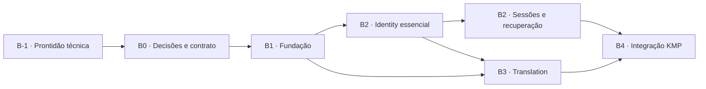

# MykytaDu API — Roadmap de entrega

> **Status:** proposta executável derivada do documento mestre
> **Versão:** 0.3
> **Data de referência:** 4 de setembro de 2026
> **Documento de origem:** [Documento Mestre Backend](documento-mestre-backend.md)

## 1. Objetivo

Este documento transforma a preparação técnica B-1 e as fases B0–B4 do backend em sprints verificáveis. Ele define objetivos, tarefas, dependências, restrições e critérios de aceitação, sem substituir o backlog da equipe nem estimar velocidade antes de haver dados reais.

O plano prioriza uma fundação reproduzível, o contrato necessário ao cliente KMP, segurança de identidade e controle de custo da tradução. Datas são deliberadamente omitidas: a Sprint B-1 deve durar de três a cinco dias úteis; as demais têm duração sugerida de duas semanas, recalibrada após as primeiras entregas.

## 2. Princípios de planejamento

- Entregar fatias verticais demonstráveis, não apenas camadas técnicas isoladas.
- OpenAPI 3.1 é a fonte da verdade do contrato HTTP.
- Segurança, privacidade, observabilidade e migrações fazem parte da funcionalidade.
- Toda decisão que altere contrato, dados ou operação deve ser registrada em ADR antes da implementação afetada.
- O monólito permanece modular; nenhuma tarefa autoriza microserviços, broker, Redis ou Kubernetes.
- O escopo de uma sprint pode diminuir, mas seus critérios de aceitação não devem ser relaxados silenciosamente.
- Alterações incompatíveis em `/api/v1` exigem decisão explícita e análise de impacto no KMP.

## 3. Marcos e dependências



| Marco | Resultado observável | Dependência |
| --- | --- | --- |
| M-1 — Ambiente pronto | baseline reconciliado, banco e testes reproduzíveis, módulos verificados e gates mínimos ativos | esqueleto inicial do repositório |
| M0 — Contrato utilizável | OpenAPI inicial validado e mock consumível pelo KMP | decisões críticas de produto |
| M1 — Fundação operável | aplicação sobe localmente, migra banco e expõe health | M0 parcial; contrato pode evoluir aditivamente |
| M2 — Identidade segura | jornada completa de conta e sessão funciona em integração | M1 |
| M3 — Tradução controlada | tradução autenticada com cache, limites e adapter substituível | M1 e autenticação mínima de M2 |
| M4 — Pronto para Sprint 12 KMP | staging e fluxos ponta a ponta validados | M0–M3 |

### 3.1 Acompanhamento das sprints

O roadmap apresenta apenas o estado consolidado. Histórico, evidências, bloqueios e mudanças de escopo ficam nos registros em [`docs/sprints/`](sprints/README.md).

| Sprint | Estado | Início | Conclusão | Registro |
| --- | --- | --- | --- | --- |
| B-1 | **Concluída** | 2026-09-04 | 2026-09-05 | [Prontidão técnica](sprints/B-1.md) |
| B0.1 | Não iniciada | — | — | a criar no planejamento da sprint |
| B0.2 | Não iniciada | — | — | a criar no planejamento da sprint |
| B1.1 | Não iniciada | — | — | a criar no planejamento da sprint |
| B1.2 | Não iniciada | — | — | a criar no planejamento da sprint |
| B2.1 | Não iniciada | — | — | a criar no planejamento da sprint |
| B2.2 | Não iniciada | — | — | a criar no planejamento da sprint |
| B2.3 | Não iniciada | — | — | a criar no planejamento da sprint |
| B3.1 | Não iniciada | — | — | a criar no planejamento da sprint |
| B3.2 | Não iniciada | — | — | a criar no planejamento da sprint |
| B4.1 | Não iniciada | — | — | a criar no planejamento da sprint |
| B4.2 | Não iniciada | — | — | a criar no planejamento da sprint |

Fluxo padrão de estado:

```text
Não iniciada → Planejada → Em andamento → Em validação → Concluída
                                  └──────→ Bloqueada
```

Uma sprint só pode ser marcada como concluída depois que seus critérios obrigatórios tiverem evidência registrada. `Bloqueada` descreve impedimento real; não substitui o registro da causa, impacto e ação necessária.

## 4. Políticas comuns a todas as sprints

### 4.1 Definition of Ready (DoR)

Uma tarefa pode entrar em execução quando:

- o comportamento esperado e o responsável funcional estão claros;
- dependências e decisões bloqueadoras estão resolvidas ou a tarefa foi explicitamente limitada;
- critérios de aceitação são observáveis e testáveis;
- impacto em contrato, segurança, privacidade, dados e operação foi identificado;
- exemplos de request/response existem quando houver mudança HTTP.

### 4.2 Definition of Done (DoD)

Uma tarefa está concluída quando:

- implementação e revisão foram concluídas;
- testes proporcionais ao risco passam no CI;
- OpenAPI, migrações, configuração e documentação afetados estão atualizados;
- nenhuma credencial, token ou dado pessoal sensível aparece em logs ou fixtures;
- métricas, logs e erros permitem diagnosticar o fluxo principal;
- critérios de aceitação foram demonstrados em ambiente apropriado;
- débitos ou decisões adiadas foram registrados, com responsável e condição de retomada.

### 4.3 Restrições transversais

- Java 25 LTS, Kotlin 2.4.10 e Spring Boot 4.1.1 são o baseline; mudanças exigem ADR.
- PostgreSQL é a única persistência inicial; schemas `identity` e `translation` têm ownership separado.
- Entidades JPA não atravessam a fronteira HTTP nem a fronteira entre módulos.
- Segredos ficam fora do repositório e TLS é obrigatório fora do ambiente local.
- Datas persistidas usam UTC/`timestamptz`; entidades persistidas usam UUIDv7.
- Erros HTTP usam `application/problem+json` e códigos estáveis.
- Não registrar senhas, tokens, hashes de tokens ou textos integrais enviados para tradução.
- Retries só se aplicam a operações idempotentes e falhas transitórias, com limite explícito.

## 5. Sprints detalhadas

### Sprint B-1 — Prontidão técnica

**Duração-alvo:** três a cinco dias úteis.

**Objetivo:** transformar o esqueleto atual em uma base determinística, testável e segura antes de qualquer implementação de Identity ou Translation.

Esta sprint valida mecanismos compartilhados; não entrega funcionalidade de negócio. Tarefas concluídas aqui não devem ser repetidas em B1: as sprints de fundação posteriores apenas evoluem ou endurecem o que já estiver aceito.

#### Sequência de execução


| ID | Tarefa | Restrições | Critérios de aceitação |
| --- | --- | --- | --- |
| B-1-T01 | Reconciliar e fixar Kotlin, Java, Spring Boot, Spring Modulith, Gradle e PostgreSQL | resolver a divergência entre Kotlin 2.3.21 do projeto e 2.4.10 do documento mestre; nenhuma versão dinâmica | matriz compatível registrada; wrapper usa Java 25; dependências resolvem sem snapshots ou ranges inesperados |
| B-1-T02 | Revisar dependências iniciais | cada dependência deve ter responsabilidade conhecida; bibliotecas Spring preferem BOM | redundâncias e dependências prematuras são removidas ou justificadas; relatório de dependências não apresenta conflitos críticos |
| B-1-T03 | Criar os módulos lógicos `app`, `api`, `identity`, `translation` e `shared` | um único módulo Gradle; evitar classes vazias sem função | Spring Modulith reconhece os módulos, não encontra ciclos e falha diante de dependência proibida simulada |
| B-1-T04 | Fixar PostgreSQL 18 no Compose | credenciais exclusivamente locais; nada de `latest` | container possui healthcheck, nome coerente e inicialização reproduzível; reset local seguro está documentado |
| B-1-T05 | Criar baseline Flyway | somente schemas nesta sprint; Hibernate não altera o schema | migração cria `identity` e `translation`, deixa `public` sem tabelas de negócio e pode ser validada em banco limpo |
| B-1-T06 | Separar configuração comum, local e de teste | profiles mudam composição técnica, não regras; nenhum segredo real versionado | configuração local integra com Compose; testes não dependem de banco manual; variáveis obrigatórias falham com mensagem clara |
| B-1-T07 | Adicionar Testcontainers PostgreSQL | versão alinhada ao Compose; isolamento por execução | teste de integração inicia PostgreSQL efêmero e executa todas as migrações |
| B-1-T08 | Escolher e configurar assertions e mocks | adotar somente um estilo principal de assertions; preferência inicial por AssertJ + MockK | teste representativo usa a convenção escolhida; decisão fica documentada |
| B-1-T09 | Configurar ktlint, Detekt e Kover | cobertura orienta risco e não impõe meta global cega | tarefas executam localmente e no CI; violações intencionais comprovam os gates |
| B-1-T10 | Criar infraestrutura mínima de Problem Details | sem endpoint de negócio artificial; `detail` não orienta lógica do cliente | fixtures/test controllers demonstram validação, erro inesperado, `code`, `traceId` e `errors[]` sem vazar stack trace |
| B-1-T11 | Configurar segurança deny-by-default | liberar apenas superfícies técnicas explicitamente aprovadas | rota não liberada retorna `401`; endpoints Actuator não ficam públicos por acidente |
| B-1-T12 | Configurar liveness, readiness, métricas e correlação | liveness não consulta dependências; telemetria não contém segredo ou texto traduzido | readiness reflete PostgreSQL; liveness permanece saudável; logs e erros compartilham `traceId` |
| B-1-T13 | Criar pipeline CI de fundação | integração usa ambiente efêmero; imagem somente após gates | formatação, análise, compilação, testes e migrações passam na mesma sequência local e no CI |
| B-1-T14 | Documentar setup e troubleshooting local | instruções partem de uma máquina com Java 25 e Docker | uma pessoa nova consegue iniciar, testar, diagnosticar e resetar o ambiente somente pela documentação |

#### Testes obrigatórios de prontidão

- **Toolchain:** wrapper e toolchain selecionam as versões fixadas em uma máquina limpa.
- **Contexto:** aplicação inicia em teste sem depender do Compose manual e falha claramente diante de configuração obrigatória ausente.
- **Banco:** PostgreSQL 18 fica saudável; Flyway cria somente os schemas previstos e valida a migração aplicada.
- **Modularidade:** módulos são detectados, não possuem ciclos e respeitam ownership; `shared` não depende dos domínios.
- **HTTP:** rota protegida sem credencial retorna `401`; violações e erros usam `application/problem+json`, código estável e `traceId`.
- **Segurança:** logs não expõem `Authorization`, tokens, credenciais ou payload sensível; Actuator expõe somente o necessário.
- **Observabilidade:** liveness independe do banco, readiness acusa sua indisponibilidade e métricas usam rotas normalizadas.
- **CI:** testes unitários, arquiteturais e de integração são distinguíveis, reproduzíveis e bloqueiam o pipeline ao falhar.

#### Fora do escopo da B-1

- cadastro, login, tabelas de usuário e sessões;
- emissão ou validação funcional de JWT;
- serviço de e-mail;
- fornecedor, cache ou quota de tradução;
- rate limit completo;
- staging ou produção.

**Saída da sprint:** marco M-1. A equipe pode iniciar B0 e B1 sem carregar riscos conhecidos de toolchain, banco, modularidade ou infraestrutura de testes.

**Condição de interrupção:** se a matriz tecnológica definida no documento mestre não for compatível, a sprint registra a evidência e atualiza a decisão/ADR antes de qualquer funcionalidade.

### Sprint B0.1 — Decisões de produto e riscos

**Objetivo:** remover ambiguidades que alteram contrato, persistência ou exposição de dados.

| ID | Tarefa | Restrições | Critérios de aceitação |
| --- | --- | --- | --- |
| B0.1-T1 | Definir cadastro e momento da verificação de e-mail | MVP parte de e-mail/senha; login social permanece fora salvo decisão contrária | fluxo nominal e estados `pending`, `active`, `blocked` e `deleted` descritos; comportamento de login antes da verificação definido |
| B0.1-T2 | Definir política de sessão por plataforma | considerar Android, Desktop e iOS; access token não é persistido no banco | TTLs, audience/client IDs, armazenamento esperado no cliente e revogação documentados |
| B0.1-T3 | Selecionar provedor de tradução | avaliar custo, idiomas, SLA, residência/retenção de dados e termos de uso | matriz de decisão aprovada; limites e tratamento de conteúdo registrados |
| B0.1-T4 | Definir origem do conteúdo traduzido | escolher entre texto enviado pelo cliente e consulta backend à AniList | fronteira de responsabilidade, payload e impacto de privacidade aprovados |
| B0.1-T5 | Definir retenção e exclusão | atender princípio de minimização de dados | TTL de traduções, retenção de auditoria e processo de exclusão/anonimização documentados |
| B0.1-T6 | Definir hospedagem inicial | não introduzir Kubernetes sem justificativa | opções de staging/produção, secret manager, banco, backup e custo estimado registrados |
| B0.1-T7 | Criar ADRs D-001 a D-008 e decisões desta sprint | um ADR por decisão arquitetural relevante | cada ADR contém contexto, decisão, consequências, estado e data |

**Saída da sprint:** decisões bloqueadoras aprovadas ou, quando possível, defaults temporários documentados com prazo de revisão.

**Risco principal:** avançar com autenticação ou tradução sob premissas implícitas e depois quebrar o contrato do cliente.

### Sprint B0.2 — Contrato primeiro e habilitação do frontend

**Objetivo:** fornecer ao KMP um contrato inicial estável e simulável antes do backend completo.

| ID | Tarefa | Restrições | Critérios de aceitação |
| --- | --- | --- | --- |
| B0.2-T1 | Especificar OpenAPI 3.1 de Identity | JSON `camelCase`, base `/api/v1`, datas ISO-8601 UTC | endpoints do documento mestre têm schemas, status, segurança e exemplos válidos |
| B0.2-T2 | Especificar OpenAPI de Translation | lote continua opcional; tamanho e idiomas devem ser explícitos | endpoint simples tem limites, exemplos, autenticação e falhas de provedor/quota modeladas |
| B0.2-T3 | Padronizar Problem Details | cliente não pode depender de `detail` | catálogo inicial de `code`, `status`, campos e exemplos aprovado pelo KMP |
| B0.2-T4 | Publicar mock/fixtures a partir do contrato | evitar mocks manuais divergentes | jornadas de sucesso e falha podem ser executadas sem backend real |
| B0.2-T5 | Adicionar validação contratual ao CI | bloquear especificação inválida e quebra incompatível não autorizada | lint e teste de compatibilidade falham propositalmente diante de exemplos inválidos/quebra simulada |
| B0.2-T6 | Definir política de evolução da API | preservar `/api/v1` para clientes publicados | regras de mudança aditiva, depreciação, suporte e versionamento registradas |

**Saída da sprint:** marco M0. O frontend consegue desenvolver contra o mock e possui códigos de erro estáveis.

### Sprint B1.1 — Fundação modular e qualidade

**Objetivo:** evoluir a fundação validada em B-1 para suportar os primeiros contratos e casos de uso reais.

| ID | Tarefa | Restrições | Critérios de aceitação |
| --- | --- | --- | --- |
| B1.1-T1 | Definir APIs públicas dos módulos | `shared` permanece técnico e pequeno; detalhes internos não são exportados | interfaces expostas são mínimas e testes impedem acesso aos pacotes internos |
| B1.1-T2 | Integrar a especificação OpenAPI ao ciclo de build | contrato continua independente de classes JVM | lint e teste de compatibilidade executam junto aos gates já criados na B-1 |
| B1.1-T3 | Evoluir Problem Details para o catálogo real de erros | nenhuma entidade de infraestrutura em DTO | códigos aprovados em B0.2 estão mapeados e cobertos por testes HTTP |
| B1.1-T4 | Preparar construção da imagem OCI | imagem sem segredo e com runtime compatível com Java 25 | imagem é criada somente após os gates e inicia com configuração externa |
| B1.1-T5 | Ampliar verificações do CI | preservar feedback rápido e separar testes lentos | contrato, cobertura, dependências e imagem possuem gates e resultados identificáveis |
| B1.1-T6 | Consolidar documentação de contribuição | comandos locais devem equivaler aos do CI | convenções de módulos, testes, migrações e contrato estão documentadas e reproduzíveis |

**Saída da sprint:** esqueleto modular verificável, sem funcionalidade de negócio ficticiamente marcada como pronta.

### Sprint B1.2 — Banco, migrações e observabilidade

**Objetivo:** evoluir os mecanismos validados na B-1 para persistência e operação dos primeiros casos de uso reais.

| ID | Tarefa | Restrições | Critérios de aceitação |
| --- | --- | --- | --- |
| B1.2-T1 | Definir convenções de migração por módulo | cada schema pertence a um módulo; migrations são somente incrementais | nomenclatura, ordem, ownership e revisão de migrations estão documentados e verificados |
| B1.2-T2 | Criar as primeiras migrations funcionais de forma evolutiva | somente tabelas exigidas pelos casos de uso seguintes; `public` continua vazio | migrations executam do zero e sobre a baseline B-1 sem intervenção manual |
| B1.2-T3 | Definir estratégia de migração por ambiente | rollback destrutivo não é automático | procedimento de avanço, compatibilidade, backup e recuperação está documentado e ensaiado |
| B1.2-T4 | Evoluir observabilidade para eventos dos módulos | logs remotos em JSON; métricas sem dados pessoais ou alta cardinalidade | dashboards/consultas distinguem falhas de infraestrutura e de domínio por código seguro |
| B1.2-T5 | Criar fixtures e utilitários de persistência reutilizáveis | testes não compartilham estado e não escondem comportamento de domínio | testes de integração dos módulos usam PostgreSQL efêmero com isolamento verificável |
| B1.2-T6 | Preparar configuração para staging | segredos externos ao repositório; profiles não alteram regra de negócio | configuração de staging é validada sem credenciais reais e possui checklist de variáveis/segredos |

**Saída da sprint:** marco M1.

### Sprint B2.1 — Cadastro, verificação e login

**Objetivo:** permitir a criação e autenticação segura de uma conta verificada.

| ID | Tarefa | Restrições | Critérios de aceitação |
| --- | --- | --- | --- |
| B2.1-T1 | Modelar usuário, credencial e papéis | e-mail normalizado e único; papéis limitados a `USER`/`ADMIN` | migração, constraints e testes cobrem duplicidade, estados e papel padrão |
| B2.1-T2 | Implementar cadastro | senha com Argon2id versionado; resposta não expõe hash | cadastro válido cria usuário pendente, credencial e token de verificação atômicos |
| B2.1-T3 | Implementar verificação de e-mail | token armazenado somente como hash, uso único e expirável | token válido ativa conta; expirado, consumido ou inválido retorna código estável |
| B2.1-T4 | Implementar login | rate limit; mensagem não facilita enumeração de contas | credenciais válidas respeitam estado/verificação; inválidas têm resposta segura e auditável |
| B2.1-T5 | Emitir JWT assimétrico | access token de 5–15 min, `kid`, issuer e audience validados | claims mínimos definidos; chave pode rotacionar sem invalidar imediatamente a anterior |
| B2.1-T6 | Cobrir abuso e concorrência | sem dados sensíveis nos logs | testes cobrem cadastro concorrente, brute force básico, tokens expirados e usuário bloqueado |

**Saída da sprint:** registro → verificação → login demonstrável por API.

### Sprint B2.2 — Sessões, refresh e logout

**Objetivo:** controlar o ciclo completo de sessões e responder à reutilização de refresh token.

| ID | Tarefa | Restrições | Critérios de aceitação |
| --- | --- | --- | --- |
| B2.2-T1 | Persistir sessões e famílias de tokens | refresh opaco e somente hash; metadados mínimos | sessão possui expiração, família e estado de revogação; token puro nunca é recuperável do banco |
| B2.2-T2 | Implementar rotação de refresh | consumo deve ser atômico | refresh válido emite novo par e invalida o anterior sob concorrência |
| B2.2-T3 | Detectar reutilização | revogar a família comprometida | reuso de token rotacionado revoga a família e produz evento/auditoria sem registrar token |
| B2.2-T4 | Implementar logout atual e global | operações idempotentes | logout atual revoga uma sessão; logout-all revoga todas as sessões do usuário |
| B2.2-T5 | Tratar bloqueio/exclusão | usuário inativo não mantém acesso renovável | bloqueio impede refresh e revoga sessões conforme decisão registrada |
| B2.2-T6 | Testar concorrência e relógio | relógio injetável; sem sleeps frágeis | cenários simultâneos, expiração e clock skew têm testes determinísticos |

**Saída da sprint:** núcleo de Identity completo para sessões.

### Sprint B2.3 — Recuperação de acesso e perfil

**Objetivo:** fechar as jornadas de conta necessárias ao MVP.

| ID | Tarefa | Restrições | Critérios de aceitação |
| --- | --- | --- | --- |
| B2.3-T1 | Solicitar recuperação de senha | resposta indistinguível exista ou não a conta | chamadas válidas retornam a mesma forma/status; rate limit e auditoria ativos |
| B2.3-T2 | Redefinir senha | token hash, uso único, expiração; revogar sessões conforme política | senha muda apenas com token válido; token não pode ser reutilizado |
| B2.3-T3 | Consultar e editar perfil mínimo | somente campos permitidos; e-mail exige fluxo próprio se editável | `/me` não expõe dados internos; patch parcial valida e persiste apenas campos autorizados |
| B2.3-T4 | Validar autorização por papel | evitar framework genérico de permissões | matriz USER/ADMIN testada em endpoints protegidos representativos |
| B2.3-T5 | Executar revisão de segurança de Identity | considerar OWASP ASVS/API Top 10 como checklist, não certificação | ameaças, controles, achados e riscos aceitos ficam registrados; críticos resolvidos |

**Saída da sprint:** marco M2.

### Sprint B3.1 — Tradução funcional e adapter de fornecedor

**Objetivo:** traduzir um conteúdo pequeno por uma porta substituível e com falhas bem definidas.

| ID | Tarefa | Restrições | Critérios de aceitação |
| --- | --- | --- | --- |
| B3.1-T1 | Definir modelo e porta `TranslationProvider` | domínio não conhece SDK/DTO do fornecedor | provider fake e adapter real implementam a mesma porta e passam contrato comum |
| B3.1-T2 | Implementar endpoint simples | autenticado; alvo inicial `pt-BR`; tamanho máximo explícito | request válido retorna idiomas e tradução; entradas inválidas retornam códigos documentados |
| B3.1-T3 | Normalizar conteúdo | preservar quebras; política de HTML decidida; não alterar significado | casos de whitespace, Unicode, HTML permitido/proibido e conteúdo vazio têm exemplos e testes |
| B3.1-T4 | Mapear falhas externas | timeout definido; retry curto apenas transitório | timeout, quota, credencial inválida e indisponibilidade mapeiam para respostas/telemetria distintas |
| B3.1-T5 | Proteger credencial e conteúdo | chave apenas no secret manager/config segura | chave não aparece em resposta/log; texto integral não é logado |
| B3.1-T6 | Criar testes controlados | CI comum não consome quota real | WireMock/MockWebServer cobre adapter; smoke real é manual ou isolado e limitado |

**Saída da sprint:** tradução ponta a ponta sem cache, pronta para ambiente controlado.

### Sprint B3.2 — Cache, quotas e resiliência

**Objetivo:** evitar custo repetido e limitar uso sem comprometer correção.

| ID | Tarefa | Restrições | Critérios de aceitação |
| --- | --- | --- | --- |
| B3.2-T1 | Persistir traduções pela chave lógica | hash inclui texto normalizado e parâmetros relevantes | texto/parâmetros idênticos geram hit; qualquer componente relevante distinto gera miss |
| B3.2-T2 | Resolver concorrência no cache | constraint única; não retornar tradução parcial | requests concorrentes não criam duplicatas observáveis nem corrompem resultado |
| B3.2-T3 | Implementar retenção definida em B0.1 | dados não permanecem além da política | expiração/limpeza é testável, observável e não apaga registros fora do escopo |
| B3.2-T4 | Aplicar rate limit e quota | distinguir autenticação, abuso e orçamento | excesso retorna `429` com código estável e orientação de retry quando aplicável |
| B3.2-T5 | Registrar consumo agregado | minimizar vínculo com pessoa; UTC | contagem diária por principal reconcilia com requests aceitas dentro da tolerância definida |
| B3.2-T6 | Instrumentar custo e latência | labels de métricas não contêm texto nem alta cardinalidade descontrolada | métricas distinguem hit/miss, provedor, sucesso/falha e latência |
| B3.2-T7 | Avaliar circuit breaker | só adotar com evidência; caso contrário registrar não decisão | teste de carga/falha sustenta a decisão; comportamento degradado é conhecido |

**Saída da sprint:** marco M3. Endpoint em condições de uso pelo KMP com custo controlável.

### Sprint B4.1 — Staging e integração KMP

**Objetivo:** provar os fluxos reais entre aplicativo e API e congelar o contrato mínimo da Sprint 12.

| ID | Tarefa | Restrições | Critérios de aceitação |
| --- | --- | --- | --- |
| B4.1-T1 | Provisionar staging | dados não produtivos, TLS, limites baixos e segredos gerenciados | deploy reproduzível; readiness e rollback operacional validados |
| B4.1-T2 | Publicar URL e configuração de cliente | nenhuma chave privilegiada embarcada no app | Android, Desktop e iOS alcançam staging conforme matriz suportada |
| B4.1-T3 | Executar testes ponta a ponta de Identity | incluir expiração e renovação, não só caminho feliz | jornadas de cadastro, verificação, login, refresh, logout e recuperação passam |
| B4.1-T4 | Executar testes ponta a ponta de Translation | usar conteúdo permitido e orçamento controlado | miss e hit de cache, limite, timeout simulado e tradução válida passam |
| B4.1-T5 | Executar testes de compatibilidade do KMP | decisões por `status` e `code`, não por mensagem | cliente compila/roda contra a OpenAPI congelada e trata erros acordados |
| B4.1-T6 | Preparar runbook operacional | incluir indisponibilidade do provedor e comprometimento de sessão | on-call consegue identificar, mitigar e comunicar cenários ensaiados |
| B4.1-T7 | Congelar contrato mínimo | mudanças posteriores são aditivas ou versionadas | versão/tag do OpenAPI, changelog e política de suporte publicados |

**Saída da sprint:** marco M4 e backend pronto para integração da Sprint 12 do KMP.

### Sprint B4.2 — Preparação de produção

**Objetivo:** fechar requisitos operacionais antes da primeira exposição produtiva.

| ID | Tarefa | Restrições | Critérios de aceitação |
| --- | --- | --- | --- |
| B4.2-T1 | Definir SLOs e alertas iniciais | valores baseados em risco e medições de staging | disponibilidade, latência e erros têm indicadores, objetivos e alertas acionáveis |
| B4.2-T2 | Validar backup e restauração | backup sem restore testado não é aceito | restauração em ambiente isolado cumpre RPO/RTO definidos |
| B4.2-T3 | Executar varreduras e revisão final | imagem e dependências entram no gate | vulnerabilidades críticas bloqueiam release; exceções têm prazo e responsável |
| B4.2-T4 | Ensaiar rotação de chaves e segredos | preservar validação dos JWTs durante janela planejada | procedimento executado em staging e evidência registrada |
| B4.2-T5 | Validar privacidade e retenção | seguir decisões B0.1 | inventário de dados, propósito, retenção e exclusão conferem com a implementação |
| B4.2-T6 | Realizar go/no-go | rollback e responsáveis nomeados | checklist aprovado e riscos residuais aceitos explicitamente |

**Saída da sprint:** release candidate com prontidão operacional verificável.

## 6. Critérios de aceitação por marco

| Marco | Critério de saída |
| --- | --- |
| M-1 | versões reconciliadas; módulos verificados; PostgreSQL/Flyway reproduzíveis; testes isolados; segurança, health, correlação e CI mínimos validados |
| M0 | OpenAPI válido; mocks executáveis; catálogo de erros e evolução contratual acordados com o frontend |
| M1 | módulos verificados; ambiente local reproduzível; migrações, health, logs e CI operacionais |
| M2 | jornadas completas de conta/sessão passam em PostgreSQL real; controles críticos de segurança revisados |
| M3 | tradução autenticada tem adapter substituível, cache correto, limites, métricas e testes de falha |
| M4 | KMP valida fluxos em staging; contrato mínimo está versionado; runbooks e rollback foram ensaiados |

## 7. Matriz resumida de riscos

| Risco | Probabilidade/impacto | Mitigação | Gatilho de revisão |
| --- | --- | --- | --- |
| Provedor de tradução exceder orçamento | média/alta | cache, quota, métricas de caracteres e limites em staging | tendência de custo acima do orçamento definido |
| Reutilização ou vazamento de refresh token | média/alta | hash, rotação atômica, famílias, revogação e auditoria | evento de reuse ou anomalia de sessões |
| Contrato divergir do KMP | média/alta | OpenAPI fonte da verdade, mock e teste de compatibilidade | mudança incompatível ou falha na integração |
| Dados traduzidos violarem política do provedor | baixa/alta, até validação | seleção jurídica/técnica, minimização e TTL | mudança de termos ou novo tipo de conteúdo |
| `shared` acumular domínio | média/média | testes de módulo e revisão arquitetural | crescimento ou dependências cruzadas recorrentes |
| Migração impedir rollback operacional | baixa/alta | mudanças compatíveis em fases, backup e restore ensaiado | migração destrutiva ou grande volume de dados |
| Baseline tecnológico sem suporte no ambiente alvo | baixa/alta | validar runtime e imagens na fundação | incompatibilidade detectada em CI/staging |

## 8. Itens explicitamente fora deste roadmap

- login social e servidor OIDC completo;
- catálogo, listas e progresso de animes;
- endpoint batch de tradução, até haver caso e limite validados;
- microserviços, mensageria, API Gateway dedicado e cache distribuído;
- painel administrativo completo;
- tradução assíncrona de documentos grandes.

Esses itens devem entrar por nova decisão de produto e planejamento, não como expansão informal de sprint.

## 9. Métricas de acompanhamento

- lead time entre mudança OpenAPI e fixture/mock disponível;
- taxa de sucesso e latência p95 por endpoint;
- falhas de autenticação, refresh reuse e sessões revogadas;
- cache hit ratio, caracteres traduzidos e custo estimado por período;
- mudanças incompatíveis detectadas antes de staging;
- tempo de restauração testado e tempo de mitigação em exercícios.

As métricas não substituem resultado de produto; servem para validar decisões de arquitetura, custo e operação.

## 10. Gestão evolutiva

Ao final de cada sprint:

1. revisar critérios de saída e evidências;
2. atualizar riscos e decisões pendentes;
3. refletir mudanças estruturais em [modelagem.md](modelagem.md);
4. atualizar ADRs e changelog contratual quando aplicável;
5. recalibrar apenas as sprints futuras com base na capacidade observada.

A primeira revisão ocorre ao final da B-1 e deve confirmar formalmente se a base está apta a receber decisões e funcionalidades. Pendências técnicas bloqueadoras não são transferidas silenciosamente para B0 ou B1.
